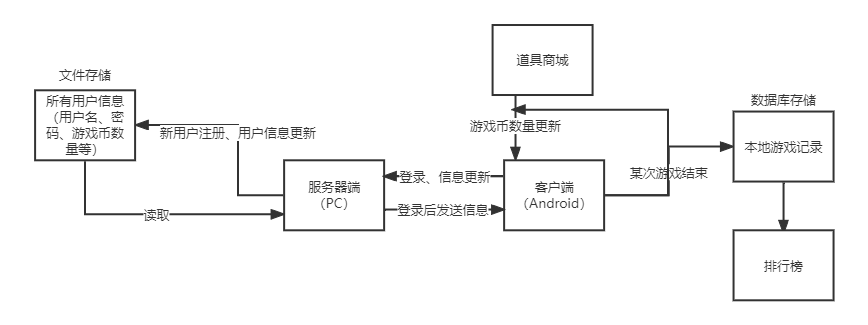
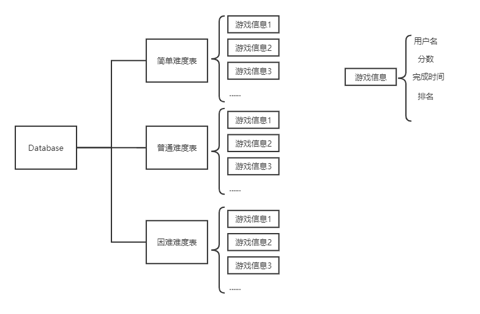
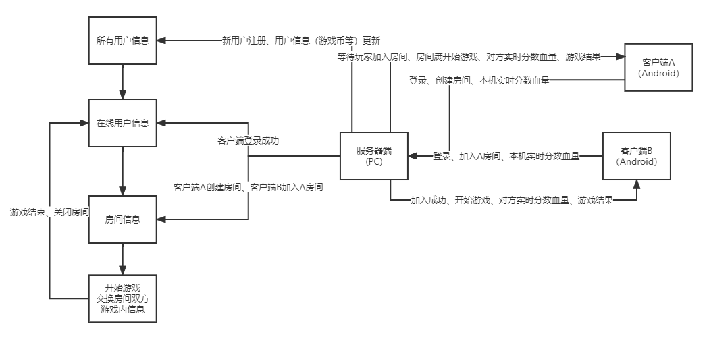

# AircraftWar for Android
**将使用java开发的飞机大战游戏移植至安卓平台，目的是作为初学者学习安卓开发、熟悉安卓开发常用框架以及技术栈并且进一步熟悉面向对象的软件构造、常用设计模式**

## 一、技术栈/运用到的相关知识：

* MVP框架
* 多线程：handler异步通信
* 网络通信：socket+json
* 数据库：SQLite

## 二、数据存储方案

## 三、数据库设计

## 四、网络通信方案
